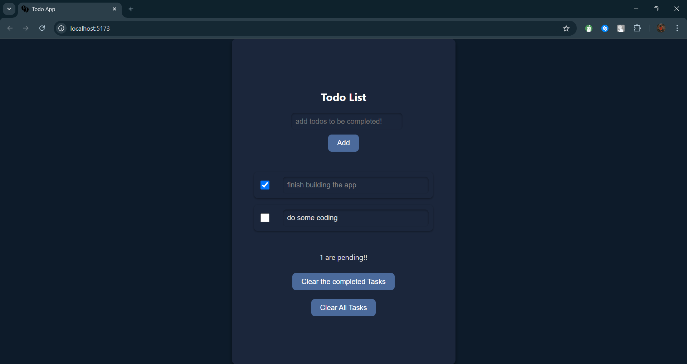
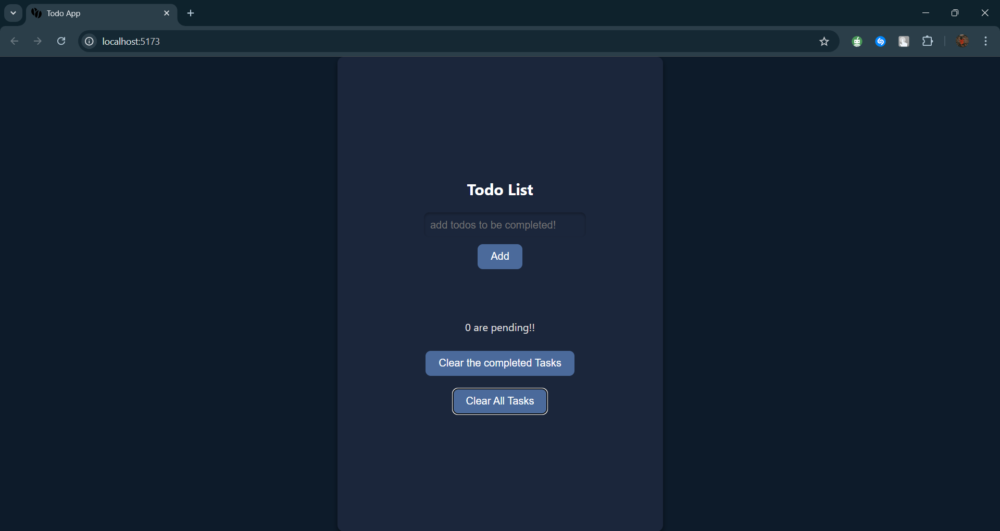

# Todo List Application

A simple and elegant Todo List application built with Svelte. This app allows users to manage tasks with options to add, mark as done, edit, and clear tasks.

## Features

- **Add New Tasks**: Input a task and press Enter or click "Add" to add it to the list.
- **Mark Tasks as Done**: Check the checkbox next to a task to mark it as completed.
- **Edit Tasks**: Click on a task to edit its description.
- **Clear Completed Tasks**: Remove only the tasks that are marked as done.
- **Clear All Tasks**: Remove all tasks from the list.
- **Responsive Design**: Adapts to fit any screen size.

## Screenshots

### Main Interface

 
 
## Installation

To run this project locally, follow these steps:

### Prerequisites

Make sure you have [Node.js](https://nodejs.org/) installed on your machine.

### Setup

1. **Clone the Repository**

    ```bash
    git clone https://github.com/your-username/todo-list-app.git
    cd todo-list-app
    ```

2. **Install Dependencies**

    ```bash
    npm install
    ```

3. **Run the Application**

    ```bash
    npm run dev
    ```

    Open your browser and navigate to `http://localhost:5000` to view the application.

## Development

Feel free to contribute to this project by submitting issues or pull requests.

### Running Tests

Currently, this project does not include automated tests. Consider adding tests for better code coverage.

## Contributing

If you would like to contribute to the project, please fork the repository and submit a pull request. Ensure that your code adheres to the coding style of the project.

## License

This project is licensed under the MIT License. See the [LICENSE](LICENSE) file for details.

## Acknowledgements

- **Svelte**: For providing a powerful and simple framework for building user interfaces.
